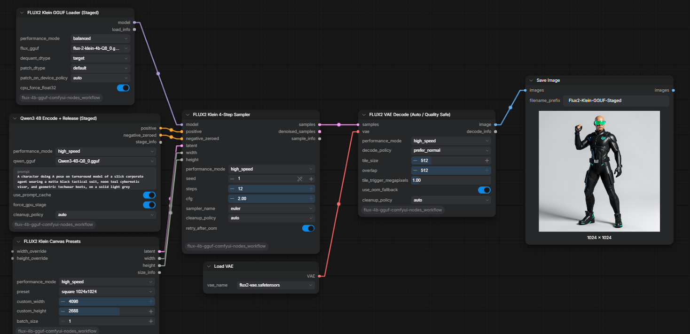
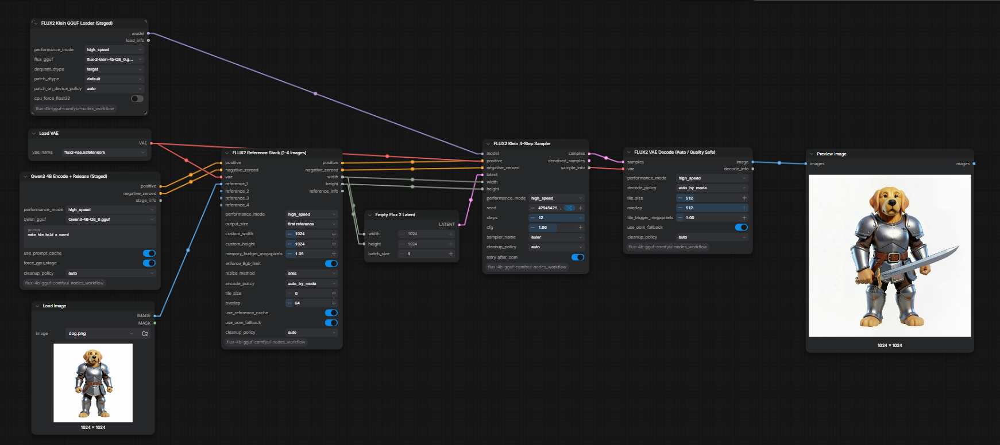
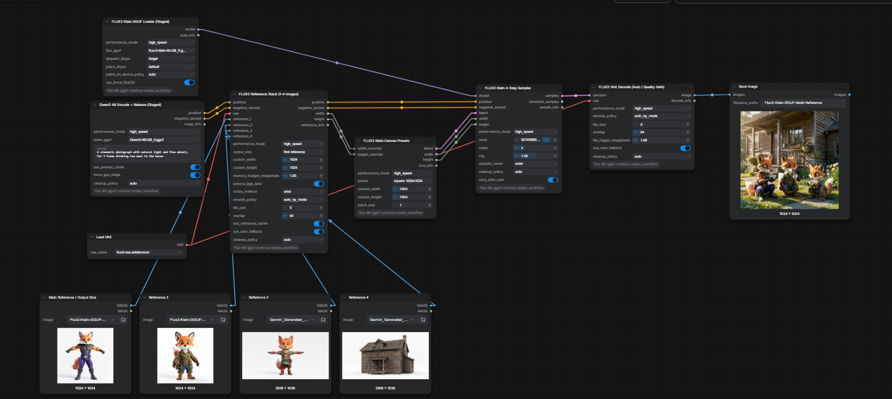

# FLUX.2 Klein 4B GGUF — Staged ComfyUI Nodes

[](LICENSE)
[](https://github.com/Comfy-Org/ComfyUI)
[](CHANGELOG.md)

## Support

If you find this project useful and would like to support my work, you can support me on Patreon. Support is completely optional and genuinely appreciated.

[Support me on Patreon](https://www.patreon.com/cw/MostafaAwad/membership)

You can also watch the project video on YouTube:

[▶ Watch the YouTube video](https://youtu.be/9wEuOEH9R70)

Memory-staged custom nodes and ready-to-use workflows for running
**FLUX.2 Klein 4B GGUF + Qwen3 4B GGUF + FLUX.2 VAE** on an 8 GB-class
NVIDIA GPU.

The node pack runs one expensive stage at a time:

1. Qwen3 4B encodes the prompt on the GPU, caches conditioning on the CPU,
   then releases its GPU allocation.
2. FLUX.2 Klein 4B becomes the only large model active during sampling.
3. FLUX releases before the VAE performs automatic tiled decoding.

No model weights are included in this repository.

## Workflow previews

### Text to image



### Single-reference editing



### Multi-reference editing



## What is included

- `FLUX2 Klein GGUF Loader (Staged)`
- `Qwen3 4B Encode + Release (Staged GPU)`
- `FLUX2 Klein 4-Step Sampler`
- `FLUX2 VAE Decode (Auto Tiled)`
- `FLUX2 Klein Canvas Presets`
- `FLUX2 Reference Stack (1-4 Images)`
- Three importable workflows in [`workflows/`](workflows/)
- A Windows installer for downloaded ZIP copies

## Requirements

- A current [ComfyUI](https://github.com/Comfy-Org/ComfyUI) build with native
  FLUX.2 Klein support
- Current [ComfyUI-GGUF](https://github.com/city96/ComfyUI-GGUF)
- An NVIDIA GPU; 8 GB VRAM is the primary target
- 16 GB system RAM minimum; more is helpful for large or multiple references

## Installation

### Option A — Git clone (recommended)

Close ComfyUI, open a terminal in `ComfyUI/custom_nodes`, and run:

```bash
git clone https://github.com/Mstafa-awad/flux-4b-gguf-comfyui-nodes_workflow.git
```

Install **ComfyUI-GGUF** with ComfyUI Manager, or clone it beside this node pack:

```bash
git clone https://github.com/city96/ComfyUI-GGUF.git
```

Install ComfyUI-GGUF's requirements with the same Python environment used by
ComfyUI, then restart ComfyUI. This node pack has no additional pip packages.

### Option B — ComfyUI Manager

In ComfyUI Manager, use **Install via Git URL** and paste:

```text
https://github.com/Mstafa-awad/flux-4b-gguf-comfyui-nodes_workflow.git
```

Also install **ComfyUI-GGUF**, then restart ComfyUI.

### Option C — Windows ZIP installer

Download **Code → Download ZIP**, extract it, and run `Install-Windows.bat`.
Drag the actual `ComfyUI` folder onto the BAT when asked. The installer copies
the node pack and workflows and can install ComfyUI-GGUF; it does not download
model weights.

## Download the models

The Q8 files are approximately 5 GB each. Download them from their respective
repositories:

| Component | Recommended file | Download | Destination |
|---|---|---|---|
| Text encoder | `Qwen3-4B-Q8_0.gguf` | [Unsloth Qwen3-4B-GGUF](https://huggingface.co/unsloth/Qwen3-4B-GGUF) | `ComfyUI/models/text_encoders/` |
| Diffusion model | `flux-2-klein-4b-Q8_0.gguf` | [Unsloth FLUX.2-klein-4B-GGUF](https://huggingface.co/unsloth/FLUX.2-klein-4B-GGUF) | `ComfyUI/models/diffusion_models/` |
| VAE | `flux2-vae.safetensors` | [Unsloth FLUX.2-VAE](https://huggingface.co/unsloth/FLUX.2-VAE/blob/main/split_files/vae/flux2-vae.safetensors) | `ComfyUI/models/vae/` |

Use **Qwen3 4B**, not Qwen3 8B. Q8_0 gives the intended quality while keeping
reasonable memory headroom on an 8 GB card. Restart ComfyUI after adding files.

## Load a workflow

Drag one of these JSON files into the ComfyUI canvas:

| Workflow | Purpose |
|---|---|
| [`Flux2-Klein-GGUF-T2I.json`](workflows/Flux2-Klein-GGUF-T2I.json) | Text-to-image generation |
| [`Flux2-Klein-GGUF-Reference-Edit.json`](workflows/Flux2-Klein-GGUF-Reference-Edit.json) | One-image editing or restyling |
| [`Flux2-Klein-GGUF-Multi-Reference-Edit.json`](workflows/Flux2-Klein-GGUF-Multi-Reference-Edit.json) | Combine details from up to four images |

Select your actual Qwen, FLUX, and VAE filenames in the loader dropdowns. The
filenames saved in the examples are placeholders matching common Unsloth names.

## Recommended controls

| Control | Recommended value | Why |
|---|---:|---|
| Steps | `4` | Klein distilled checkpoint default |
| CFG | `1.0` | Intended distilled guidance |
| Sampler | `euler` | Fast and stable for the four-step model |
| Scheduler | Automatic | Uses ComfyUI's native `Flux2Scheduler` internally |
| Canvas | About `1.0 MP` | Best balance for 8 GB VRAM |
| Batch | `1` | Avoids unnecessary memory duplication |
| `force_gpu_stage` | `true` | Fast Qwen encode, followed by explicit release |
| `release_after_encode` | `true` | Frees Qwen before FLUX loads |
| `clean_vram_before_sampling` | `true` | Gives FLUX the largest contiguous VRAM block |
| VAE decode mode | `auto (8GB safe)` | Automatically chooses tiled decoding |
| VAE tile / overlap | `512 / 64` | Good seam control without excessive memory use |
| `release_after_decode` | `true` | Releases the VAE after output |

The distilled checkpoint uses zeroed negative conditioning. A normal negative
prompt is intentionally not exposed. A filename containing `base` is rejected
because the Base checkpoint requires different guidance and sampling settings.

## Reference-image memory settings

For 8 GB GPUs, keep these values in `FLUX2 Reference Stack`:

| Control | Safe default |
|---|---:|
| `tile_size` | `512` |
| `overlap` | `64` |
| `memory_budget_megapixels` | `1.05` |
| `enforce_8gb_limit` | `true` |
| `resize_method` | `area` |

The memory budget is shared by every connected reference. A very large source
image is resized before VAE encoding instead of expanding FLUX into system RAM.
Disable `enforce_8gb_limit` only when deliberately using higher-memory hardware.

## How staging behaves

- If only the seed changes, cached prompt conditioning is reused and Qwen does
  not run again.
- If the prompt changes, Qwen is loaded for encoding and released afterward.
- Sampling delegates to ComfyUI's native `RandomNoise`, `Flux2Scheduler`,
  `CFGGuider`, and `SamplerCustomAdvanced` implementations.
- Reference latents are applied to both positive and zeroed-negative
  conditioning.
- On GPUs with 9 GiB VRAM or less, `auto` VAE mode selects tiled decoding.

## Troubleshooting

### `object of type 'NodeOutput' has no len()`

Update this repository. Version 1.0.1 and newer supports ComfyUI's V3
`NodeOutput` return container.

### A reference image makes generation very slow or fills system RAM

Update to version 1.0.2 or newer and keep `enforce_8gb_limit=true` with
`memory_budget_megapixels=1.05`. The input is then resized before VAE encoding.

### Nodes are red or missing

Update ComfyUI and ComfyUI-GGUF, restart ComfyUI completely, then refresh the
browser. Confirm that this repository is directly inside `ComfyUI/custom_nodes`.

### A model is missing from a dropdown

Check the destination folders above, confirm the extension is `.gguf` or
`.safetensors`, and restart ComfyUI so its model list is refreshed.

### Out of memory during sampling

Use batch 1, about one megapixel, Q8_0 rather than a larger quant, and keep all
three release/cleanup controls enabled. Close other GPU-heavy applications.

## Updating

```bash
cd ComfyUI/custom_nodes/flux-4b-gguf-comfyui-nodes_workflow
git pull --ff-only
```

Restart ComfyUI after every update.

## License and third-party projects

The source code and repository documentation are licensed under
[GPL-3.0-or-later](LICENSE). This conservative choice is compatible with the
GPL-licensed ComfyUI host. See [THIRD_PARTY_NOTICES.md](THIRD_PARTY_NOTICES.md)
for upstream licenses and model notices.

Model weights are separate downloads and remain governed by their own model
cards and licenses. This is an independent community project and is not
affiliated with, sponsored by, or endorsed by Comfy Org, Black Forest Labs,
Qwen, Unsloth, or the ComfyUI-GGUF maintainers.

## Contributing

Bug reports and pull requests are welcome. Please read
[CONTRIBUTING.md](CONTRIBUTING.md) before submitting code or assets.

---

Copyright © 2026 Mostafa Awad
