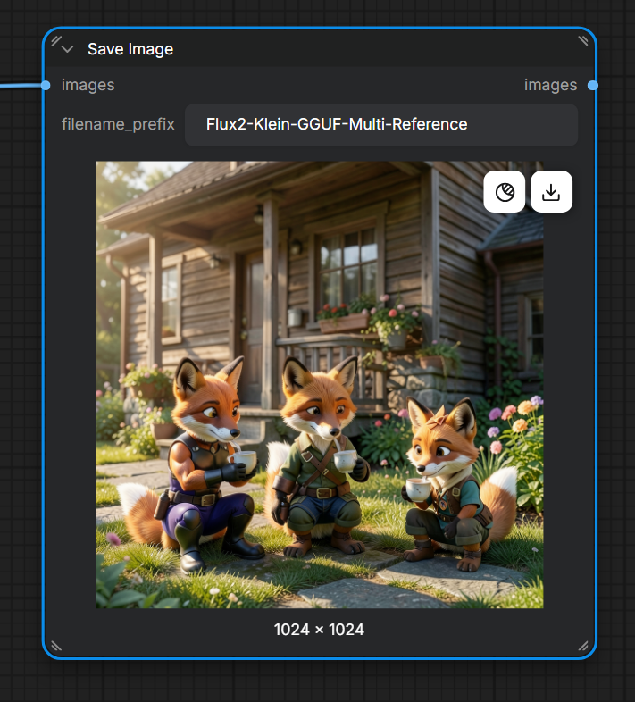

# FLUX.2 Klein 4B GGUF — Staged ComfyUI Nodes

[](LICENSE)
[](https://github.com/Comfy-Org/ComfyUI)
[](CHANGELOG.md)

## Support

If you find this project useful and would like to support my work, you can support me on Patreon.

[Support me on Patreon](https://www.patreon.com/cw/MostafaAwad/membership)

You can also watch the project video on YouTube:

[▶ Watch the YouTube video](https://youtu.be/9wEuOEH9R70)

Memory-staged custom nodes and ready-to-use workflows for running
**FLUX.2 Klein 4B GGUF + Qwen3 4B GGUF + FLUX.2 VAE** on an 8 GB-class
NVIDIA GPU — or, since v2.0.0, **fully on CPU** with zero GPU usage.

The node pack runs one expensive stage at a time:

1. Qwen3 4B encodes the prompt, caches conditioning on the CPU,
   then releases its memory allocation.
2. FLUX.2 Klein 4B becomes the only large model active during sampling.
3. FLUX releases before the VAE performs automatic (seam-safe) decoding.

How aggressively stages are released, whether the VAE tiles, and whether the
GPU is used at all is now controlled by a single **performance mode** on every
node (`balanced`, `low_vram`, `high_speed`, `cpu_only`).

No model weights are included in this repository.

## What is new in v2.0.0

- **Performance modes** on every node: `balanced` (default), `low_vram`,
  `high_speed`, `cpu_only`.
- **True CPU-only execution** — the ggml C++ backend inside ComfyUI-GGUF can
  be fully blinded from the GPU (0% GPU usage, verified).
- **Smart caches**: exact-match prompt cache, reference-latent cache, and
  scheduler-sigma cache. Re-runs skip Qwen and re-encoding entirely.
- **Seam-free VAE policies**: `prefer_normal` decode (no tiles = no squares),
  with automatic tiled fallback on OOM, and sane overlap rules when tiling.
- **High-resolution workflows**: output size is no longer silently clamped by
  the reference budget (see wiring note below).
- **OOM safety net**: emergency cleanup + automatic retry with smaller tiles
  on encode, decode, and sampling.
- **Upgraded Memory Report**: resolved mode, CUDA visibility, device type,
  VRAM/RAM, tracked models, cache stats, per-stage timings, cache clearing.
- **Two launcher scripts**: `StartComfy_GPU.bat` and `StartComfy_CPU.bat`.
- Code hygiene fixes: commented license header, correct `__future__` import,
  trailing spaces removed from all mapping keys.

Quality guarantees are unchanged: Euler, 4 steps, CFG 1.0, zeroed negative
conditioning, all four reference slots, official canvas presets. No
quality-reducing shortcut is ever enabled automatically.

## Workflow previews

### Text to image


### Single-reference editing


### Multi-reference editing


### Multi-reference result



## What is included

- `FLUX2 Klein GGUF Loader (Staged)`
- `Qwen3 4B Encode + Release (Staged)`
- `FLUX2 Klein Canvas Presets`
- `FLUX2 Klein 4-Step Sampler`
- `FLUX2 Reference Stack (1-4 Images)`
- `FLUX2 VAE Decode (Auto / Quality Safe)`
- `FLUX2 Staged Memory Report`
- Three importable workflows in [`workflows/`](workflows/)
- A Windows installer for downloaded ZIP copies
- `StartComfy_GPU.bat` and `StartComfy_CPU.bat` launcher scripts

## Requirements

- A current [ComfyUI](https://github.com/Comfy-Org/ComfyUI) build with native
  FLUX.2 Klein support
- Current [ComfyUI-GGUF](https://github.com/city96/ComfyUI-GGUF)
- **GPU path:** an NVIDIA GPU; 8 GB VRAM is the primary target
- **CPU-only path:** any modern CPU with AVX2; 16 GB system RAM is the absolute
  minimum, 32 GB recommended; SSD strongly recommended. CPU mode is a
  "does it run" mode — expect minutes per image, not seconds.
- 16 GB system RAM minimum for GPU use; more is helpful for large or multiple
  references

## Installation

### Option A — Git clone (recommended)

Close ComfyUI, open a terminal in `ComfyUI/custom_nodes`, and run:

```bash
git clone https://github.com/Mstafa-awad/flux-4b-gguf-comfyui-nodes_workflow.git
```

Install **ComfyUI-GGUF** with ComfyUI Manager, or clone it beside this node pack:

```bash
git clone https://github.com/city96/ComfyUI-GGUF.git
```

Install ComfyUI-GGUF's requirements with the same Python environment used by
ComfyUI, then restart ComfyUI. This node pack has no additional pip packages.

### Option B — ComfyUI Manager

In ComfyUI Manager, use **Install via Git URL** and paste:

```text
https://github.com/Mstafa-awad/flux-4b-gguf-comfyui-nodes_workflow.git
```

Also install **ComfyUI-GGUF**, then restart ComfyUI.

### Option C — Windows ZIP installer

Download **Code → Download ZIP**, extract it, and run `Install-Windows.bat`.
Drag the actual `ComfyUI` folder onto the BAT when asked. The installer copies
the node pack and workflows and can install ComfyUI-GGUF; it does not download
model weights.

## Download the models

The Q8 files are approximately 5 GB each. Download them from their respective
repositories:

| Component | Recommended file | Download | Destination |
|---|---|---|---|
| Text encoder | `Qwen3-4B-Q8_0.gguf` | [Unsloth Qwen3-4B-GGUF](https://huggingface.co/unsloth/Qwen3-4B-GGUF) | `ComfyUI/models/text_encoders/` |
| Diffusion model | `flux-2-klein-4b-Q8_0.gguf` | [Unsloth FLUX.2-klein-4B-GGUF](https://huggingface.co/unsloth/FLUX.2-klein-4B-GGUF) | `ComfyUI/models/diffusion_models/` |
| VAE | `flux2-vae.safetensors` | [Unsloth FLUX.2-VAE](https://huggingface.co/unsloth/FLUX.2-VAE/blob/main/split_files/vae/flux2-vae.safetensors) | `ComfyUI/models/vae/` |

Use **Qwen3 4B**, not Qwen3 8B. Q8_0 gives the intended quality while keeping
reasonable memory headroom on an 8 GB card. Restart ComfyUI after adding files.

## Launcher scripts

Two batch files ship with the pack. Keep both and launch the one you need.

### `StartComfy_GPU.bat` — normal GPU runs

```bat
@echo off
cd /D "%~dp0"
title ComfyUI - TRELLIS.2 - 8GB VRAM
set "PYTORCH_CUDA_ALLOC_CONF=expandable_segments:True"
set "PYTHONUNBUFFERED=1"
.\python_embeded\python.exe -I -W ignore::FutureWarning ComfyUI\main.py ^
--windows-standalone-build ^
--use-pytorch-cross-attention ^
--enable-manager ^
--enable-dynamic-vram ^
--async-offload 2 ^
--port 8188
echo.
echo :: ComfyUI stopped ::
pause
```

### `StartComfy_CPU.bat` — true CPU-only runs

```bat
@echo off
cd /D "%~dp0"
title ComfyUI - TRUE CPU ONLY
set "PYTHONUNBUFFERED=1"

:: Force the GGUF C++ engine to disable its CUDA backend
set "GGML_NO_CUDA=1"

:: Hide the GPU from PyTorch and Windows entirely
set "CUDA_VISIBLE_DEVICES=-1"

.\python_embeded\python.exe -I -W ignore::FutureWarning ComfyUI\main.py ^
--windows-standalone-build ^
--cpu ^
--enable-manager ^
--port 8188

echo.
echo :: ComfyUI stopped ::
pause
```

Why both environment variables are required: ComfyUI's `--cpu` flag only
switches PyTorch's device. The ggml C++ backend inside ComfyUI-GGUF has its own
CUDA path and will silently keep using the GPU during sampling unless
`GGML_NO_CUDA=1` and `CUDA_VISIBLE_DEVICES=-1` hide it completely.

Do **not** pin thread-count variables (`OMP_NUM_THREADS`, `MKL_NUM_THREADS`,
`GGML_N_THREADS`, ...). Forcing them caused thread thrashing over RAM
bandwidth and made generation slower in testing. The engines auto-select the
best thread count.

## Load a workflow

Drag one of these JSON files into the ComfyUI canvas:

| Workflow | Purpose |
|---|---|
| [`Flux2-Klein-GGUF-T2I.json`](workflows/Flux2-Klein-GGUF-T2I.json) | Text-to-image generation |
| [`Flux2-Klein-GGUF-Reference-Edit.json`](workflows/Flux2-Klein-GGUF-Reference-Edit.json) | One-image editing or restyling |
| [`Flux2-Klein-GGUF-Multi-Reference-Edit.json`](workflows/Flux2-Klein-GGUF-Multi-Reference-Edit.json) | Combine details from up to four images |

Select your actual Qwen, FLUX, and VAE filenames in the loader dropdowns. The
filenames saved in the examples are placeholders matching common Unsloth names.

**v2.0.0 wiring note:** connect the **Canvas node's `width`/`height` outputs
directly to the Sampler's `width`/`height` inputs**. The Reference Stack's
width/height outputs remain protected by the memory budget and are meant for
reference encoding only — feeding them to the sampler will clamp your output
resolution (see *High-resolution workflows* below).

## Performance modes

Set the same `performance_mode` on every node in the workflow.

| Mode | Best for | Behavior |
|---|---|---|
| `balanced` (default) | 8–12 GB GPUs | Releases Qwen before sampling so FLUX loads fully into VRAM; keeps VAE available for decode; tiles only when needed |
| `low_vram` | 6–8 GB GPUs, large images | Aggressive stage cleanup, tiled VAE, strict reference budgets — closest to v1.x behavior |
| `high_speed` | 12 GB+ GPUs, prompt iteration | Keeps models loaded, minimal cleanup, larger VAE tiles |
| `cpu_only` | No-GPU machines | Disables GPU staging, CPU-safe memory behavior, resolution warnings; pair with `StartComfy_CPU.bat` |

**8 GB warning:** do not use `high_speed` on an 8 GB card. Keeping Qwen
resident leaves no room for FLUX, which then streams from system RAM
(~33 s/step instead of ~2 s/step). Use `balanced`.

### Cleanup policies

Each stage node also exposes `cleanup_policy`:

| Policy | Behavior |
|---|---|
| `auto` (default) | Mode-driven release schedule |
| `always_release` | v1.x-style full release after every stage |
| `keep_loaded` | Keep models resident (only sensible with VRAM/RAM headroom) |

## Recommended controls

| Control | Recommended value | Why |
|---|---:|---|
| `performance_mode` | `balanced` (8–12 GB) / `cpu_only` (no GPU) | Correct staging for your hardware |
| Steps | `4` | Klein distilled checkpoint default |
| CFG | `1.0` | Intended distilled guidance |
| Sampler | `euler` | Fast and stable for the four-step model |
| Scheduler | Automatic | Uses ComfyUI's native `Flux2Scheduler` internally (cached) |
| Canvas | About `1.0 MP` | Best balance for 8 GB VRAM |
| Batch | `1` | Avoids unnecessary memory duplication |
| `cleanup_policy` | `auto` | Mode-driven, avoids v1.x over-cleaning |
| `use_prompt_cache` | `true` | Skips Qwen when the prompt is unchanged |
| `use_reference_cache` | `true` | Skips VAE re-encoding of identical references |
| `decode_policy` | `prefer_normal` | Seamless decode first, tiled only on OOM |
| `encode_policy` | `auto_by_mode` | Safe reference encoding per mode |
| VAE tile / overlap (when tiling) | `512 / 128` | Overlap ≈ ¼ of tile size prevents visible seams |
| `tile_trigger_megapixels` | `1.0` | Auto-mode tiling threshold |
| `use_oom_fallback` / `retry_after_oom` | `true` | Automatic smaller-tile / cleanup retry |

The distilled checkpoint uses zeroed negative conditioning. A normal negative
prompt is intentionally not exposed. A filename containing `base` is rejected
because the Base checkpoint requires different guidance and sampling settings.

## VAE decode and the "square grid" fix

Visible squares in the output are **tile seams** from tiled VAE decode: the
overlap region is the only blending zone between tiles, and a 64 px overlap on
512 px tiles is too narrow to hide them.

Rules of thumb:

- **No tiles = no seams.** `decode_policy = prefer_normal` attempts a normal
  decode first and falls back to tiling only if it runs out of memory.
- **If you must tile:** overlap ≈ ¼ of tile size (tile 512 → overlap 128;
  tile 768 → overlap 192).
- If seams persist, also set `encode_policy = prefer_normal` on the Reference
  Stack so reference latents are not tiled either.
- `always_tiled` is only recommended for very large outputs on small VRAM.

## Caching

All caches are **exact-match only** (prompt text, file fingerprints, VAE
identity, mode, and tile settings are part of the key), so a cache hit can
never change your output quality.

| Cache | Slots | Skips |
|---|---:|---|
| Prompt cache | 4 | Full Qwen load + encode when the prompt and settings are unchanged |
| Reference cache | 8 | VAE encoding of an identical reference image |
| Scheduler cache | 64 | `Flux2Scheduler` recomputation per (steps, width, height) |

Clear all caches at any time with the Memory Report node's
`clear_caches = true`.

## Reference-image memory settings

For 8 GB GPUs, keep these values in `FLUX2 Reference Stack`:

| Control | Safe default |
|---|---:|
| `memory_budget_megapixels` | `1.05` |
| `enforce_8gb_limit` | `true` |
| `resize_method` | `area` |
| `encode_policy` | `auto_by_mode` |
| `tile_size` / `overlap` | `512 / 128` |

The memory budget is shared by every connected reference (up to 4). A very
large source image is resized before VAE encoding instead of expanding FLUX
into system RAM. Disable `enforce_8gb_limit` only when deliberately using
higher-memory hardware. The budget protects **reference encoding only** — it
no longer clamps your final output size when the Canvas is wired directly to
the Sampler.

## High-resolution workflows (4-view character sheets)

Generating a single 4096×2688 turnaround sheet (~11 MP, ~10× the validated
area) is possible but heavy on 8 GB:

1. Wire **Canvas `width`/`height` → Sampler `width`/`height`** so the output
   size survives the reference budget.
2. Keep `enforce_8gb_limit = true` (budget `1.05–2.0`) so the 6336×2688 source
   sheet is downscaled before encoding.
3. Set `decode_policy = always_tiled`, `tile_size = 512`, `overlap = 128`.
4. Use `balanced` on all nodes so FLUX loads fully into VRAM.
5. Expect minutes of sampling and tiled decode. If sampling OOMs, step down:
   3072×2048 → 2048×1360.

**Recommended alternative:** generate the four views as separate portrait
passes (e.g. `832×1248`), each using the same turnaround sheet as reference,
then stitch them side by side. Each view gets a full-detail pass, there is no
OOM risk, and a single bad view can be regenerated alone.

## CPU-only guide

1. Launch with `StartComfy_CPU.bat` (see *Launcher scripts*).
2. Set `performance_mode = cpu_only` on every node.
3. In the GGUF Loader set `dequant_dtype` and `patch_dtype` to `bfloat16`
   (or `float16`) and leave `cpu_force_float32` **unchecked** — float32 on CPU
   is roughly 2× slower for no quality benefit here.
4. Keep batch size 1 and start at ≤ 1 MP.
5. Verify with the Memory Report node: it should show CUDA not visible and
   the Comfy device as CPU. Task Manager should show the GPU at 0% even
   during sampling.

Expectations: ~5 minutes per ~1 MP image with bfloat16 is a good result. Low
total CPU% in Task Manager is normal — cores wait on RAM bandwidth, and
Windows averages busy P-cores with idle E-cores.

GPU-hardcoded third-party nodes (for example some 3D/mesh packs) may print
`IMPORT FAILED ... No CUDA GPUs are available` at startup in CPU mode. This is
harmless to this node pack.

## How staging behaves

- If only the seed changes, cached prompt conditioning is reused and Qwen does
  not run again.
- If the prompt changes, Qwen is loaded for encoding and released afterward
  (unless `keep_loaded` or `high_speed` keeps it resident).
- Sampling delegates to ComfyUI's native `RandomNoise`, `Flux2Scheduler`,
  `CFGGuider`, and `SamplerCustomAdvanced` implementations.
- Reference latents are applied to both positive and zeroed-negative
  conditioning.
- Cleanup is mode-driven: `balanced` releases Qwen before sampling and FLUX
  before decode; `low_vram` releases everything between stages; `high_speed`
  keeps models resident; `cpu_only` avoids GPU staging entirely.
- On memory errors, the pack performs emergency cleanup and retries with
  smaller tiles (encode/decode) or a clean retry (sampling).

## Memory Report

`FLUX2 Staged Memory Report` is a diagnostic dashboard: selected vs resolved
mode, CUDA visibility, Comfy device, free/total VRAM and RAM, torch thread
count, model file sizes, actively tracked models (clip/unet/vae), cache
occupancy, per-stage timings, and a `clear_caches` switch. Add it to any
workflow while tuning modes.

## Troubleshooting

### GPU usage spikes during a "CPU-only" run

The ggml C++ backend ignores PyTorch's CPU state. Use `StartComfy_CPU.bat`
with `GGML_NO_CUDA=1` and `CUDA_VISIBLE_DEVICES=-1`, and set `cpu_only` on all
nodes. Confirm with the Memory Report node.

### CPU generation is about 2× slower than before

The model is running in float32. Set `dequant_dtype` / `patch_dtype` to
`bfloat16` in the GGUF Loader and uncheck `cpu_force_float32`.

### Square grid / visible seams in the output

Tiled VAE overlap is too small. Use `decode_policy = prefer_normal`, or tile
512 with overlap 128. See *VAE decode and the "square grid" fix*.

### Sampling takes ~30+ seconds per step on an 8 GB GPU

`high_speed` kept Qwen in VRAM, so FLUX streamed from system RAM
(`loaded partially ... offloaded`). Switch every node to `balanced`.

### My 4096×2688 canvas produced a ~1 MP image

The Reference Stack's width/height outputs are budget-protected. Wire the
Canvas node's `width`/`height` directly into the Sampler instead.

### Task Manager shows low CPU% during CPU generation

Normal. CPU cores stall on RAM bandwidth, and Windows averages P-cores and
E-cores. Do not pin thread-count environment variables; it made things slower
in testing.

### `IMPORT FAILED` for some custom nodes in CPU mode

GPU-hardcoded packs (e.g. certain mesh/3D nodes) crash at import when the GPU
is hidden. Harmless to this node pack.

### `object of type 'NodeOutput' has no len()`

Update this repository. Version 1.0.1 and newer supports ComfyUI's V3
`NodeOutput` return container.

### A reference image makes generation very slow or fills system RAM

Update to version 1.0.2 or newer and keep `enforce_8gb_limit=true` with
`memory_budget_megapixels=1.05`. The input is then resized before VAE encoding.

### Nodes are red or missing

Update ComfyUI and ComfyUI-GGUF, restart ComfyUI completely, then refresh the
browser. Confirm that this repository is directly inside `ComfyUI/custom_nodes`.

### A model is missing from a dropdown

Check the destination folders above, confirm the extension is `.gguf` or
`.safetensors`, and restart ComfyUI so its model list is refreshed.

### Out of memory during sampling

Use batch 1, about one megapixel, Q8_0 rather than a larger quant, and keep
`cleanup_policy = auto` (or `always_release` on 6 GB). Close other GPU-heavy
applications. On very large canvases, step down resolution as described in
*High-resolution workflows*.

## Updating

```bash
cd ComfyUI/custom_nodes/flux-4b-gguf-comfyui-nodes_workflow
git pull --ff-only
```

Restart ComfyUI after every update.

## License and third-party projects

The source code and repository documentation are licensed under
[GPL-3.0-or-later](LICENSE). This conservative choice is compatible with the
GPL-licensed ComfyUI host. See [THIRD_PARTY_NOTICES.md](THIRD_PARTY_NOTICES.md)
for upstream licenses and model notices.

Model weights are separate downloads and remain governed by their own model
cards and licenses. This is an independent community project and is not
affiliated with, sponsored by, or endorsed by Comfy Org, Black Forest Labs,
Qwen, Unsloth, or the ComfyUI-GGUF maintainers.

## Contributing

Bug reports and pull requests are welcome. Please read
[CONTRIBUTING.md](CONTRIBUTING.md) before submitting code or assets.

---

## 🚀 SUPPORT MOSTAADTECH

### ❤️ Enjoying this project / workflow?

I'm **MostAadTech**, I create FREE ComfyUI workflows, local AI tools, 3D pipelines, and open-source projects.

If this project or workflow helped you, **please consider following me or supporting my work**. It helps me keep building, testing, and releasing more free tools and workflows.

---

## 💜 Support Me on Patreon

👉 **[Support MostAadTech on Patreon](https://www.patreon.com/cw/MostafaAwad/membership)**

Your support helps me spend more time developing **FREE AI tools, ComfyUI workflows, and 3D pipelines**.

---

## 🌐 Follow MostAadTech

* ▶️ **[YouTube](https://www.youtube.com/@MostAadTech)** — Tutorials, workflows & AI projects
* 📸 **[Instagram](https://www.instagram.com/mostaadtech/)** — Projects, updates & behind the scenes
* 𝕏 **[X / Twitter](https://x.com/MostAadTech)** — Updates, releases & experiments
* 💻 **[GitHub](https://github.com/Mstafa-awad)** — Open-source projects & code

---

### ⭐ One Follow Helps

**Follow • Star • Share • Support**

Every follow, GitHub star, share, and Patreon supporter helps me continue making **FREE tools for the AI community.**

**Thank you for supporting MostAadTech! ❤️**

---

Copyright © 2026 Mostafa Awad
